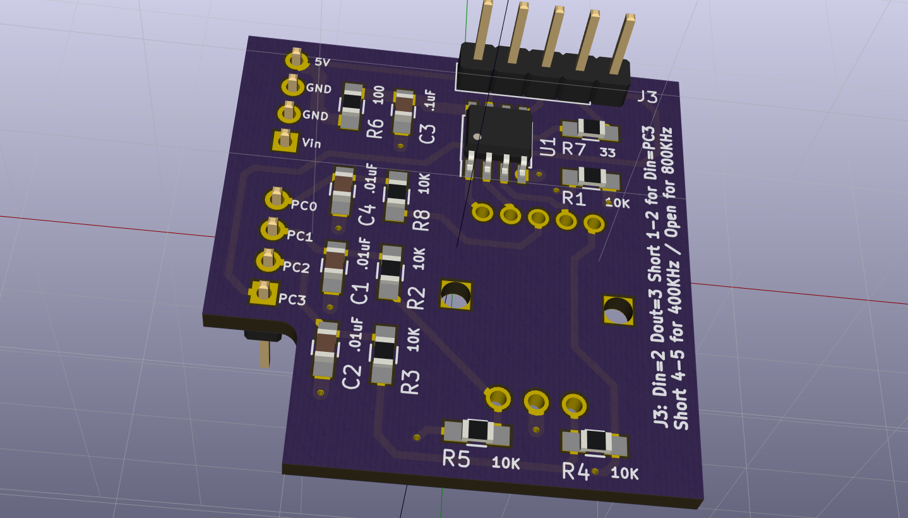

A breakout board for SparkFun's *Rotary Encoder - Illuminated (RGB)*
https://www.sparkfun.com/products/10982. The part includes an RGB LED, which is controlled by a WS2811 driver on the board, turning it into a NeoPixel. See Adafruit's [The Magic of NeoPixels](https://learn.adafruit.com/adafruit-neopixel-uberguide/the-magic-of-neopixels?view=all) for more information about them.

The board can be used as an Arduino Uno shield, or on a breadboard. An extra header on the top brings out the data in and out lines, and allows selecting the WS2811 bitrate (either 400KHz or 800KHz). When used with an Arduino, the data in can come from pin PC3, or through the top side header.

Designed with KiCad.

