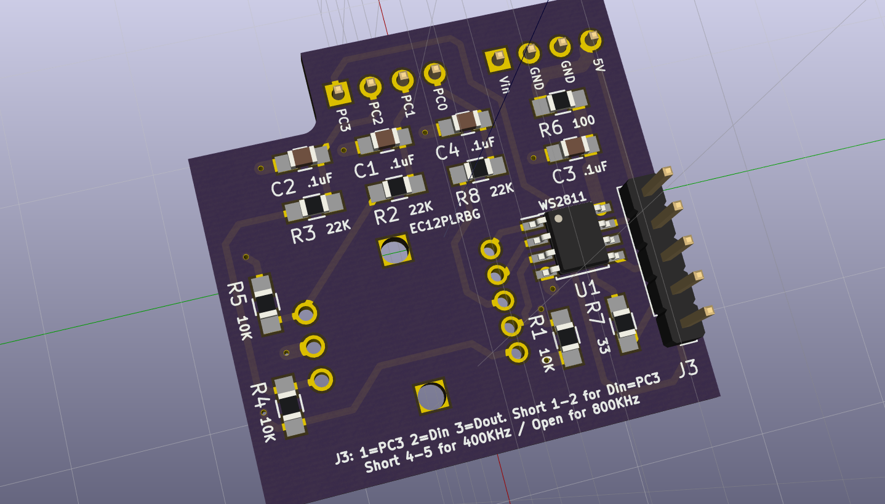

A breakout board for SparkFun's *Rotary Encoder - Illuminated (RGB)*
https://www.sparkfun.com/products/10982

The board can be used as an Arduino Uno shield, or on a breadboard. Designed with KiCad.

